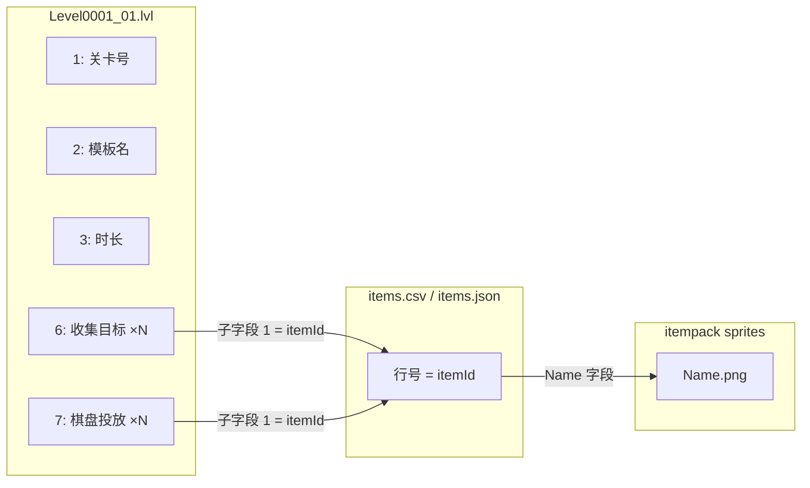

# Match Factory 关卡配置图文说明

本文档说明 `.lvl` 与 `items.csv`、导出贴图之间的对应关系。结论基于本仓库 `protoc --decode_raw` 样例与 `items.json`（910 行）交叉验证。

---

## 1. 关卡文件长什么样？

每个关卡 ID 通常有 **两个** `.lvl` 文件（变体 `_00`、`_01` …）：

| 文件 | 体积（典型） | 角色（推断） |
|------|----------------|--------------|
| `Level0001_00.lvl` | 很小（数十字节） | **LevelBaseData**：关卡号 + 棋盘格子编码（字段 2/3 为二进制串） |
| `Level0001_01.lvl` | 稍大（数十字节） | **LevelData**：模板名、时长、难度、**收集目标**、**棋盘投放** |

目录：

- `UnityDataAssetPack/assets/Levels/`
- `UnityDataAssetPack/assets/DLCFallbackLevels/`（DLC 回退副本）

**注意**：`Level0852_00.lvl` 里的 **852 是关卡编号**，不是道具 ID。道具 ID 出现在 `_01` 文件里字段 `6` / `7` 的子字段 `1`。

---

## 2. LevelData（`*_01.lvl`）字段含义

以 **第 1 关** `Level0001_01.lvl` 的 `decode_raw` 为例：

```text
1: 1                 ← 关卡号（与文件名 Level0001 一致）
2: "1_M_1_1"         ← 模板键，与 level_templates_*.csv 体系对应
3: 300               ← 时长（秒），常见 210–300
5: 5                 ← 难度/宽松度相关标量（与 LevelData.Difficulty 等对齐，待 Il2Cpp 确认）
6 { 1: 852  2: 3 }   ← 收集目标 #1：道具 ID 852，数量 3
6 { 1: 61   2: 3 }   ← 收集目标 #2：道具 ID 61，数量 3
6 { 1: 853  2: 3 }   ← 收集目标 #3：道具 ID 853，数量 3
```

### 字段 6 vs 字段 7

| Protobuf 字段 | 结构 | 含义（研究结论） | 出现规律 |
|---------------|------|------------------|----------|
| **6** | `{ 1: itemId, 2: count }` | **收集目标**：玩家需从棋盘收集并提交的数量 | 早期关多为 3 条；`count` 多为 3、9、12、15、18 |
| **7** | `{ 1: itemId, 2: count }` | **棋盘投放**：该道具在棋盘上的数量/权重 | 第 2 关起常见；`count` 常更大（如 24） |

示例 **第 2 关** `Level0002_01.lvl`：

- 字段 **6**：`92 × 18` → `HelicopterGrey`（收集）
- 字段 **7**：`519 × 9`、`804 × 9` → 棋盘上投放的道具

示例 **第 4 关**（水果关）：

- 字段 **6**：`40 Banana`、`41 Carrot`（要收集的）
- 字段 **7**：`55 PepperRed`、`57 Pumpkin` 等（棋盘上多的）



---

## 3. 852 / 853 是不是道具 ID？如何在物品表查？

**是。** 这里的数字 **不是** 关卡号，而是 **`items.csv` 的数据行索引（从 0 开始）**。

ingest 后的 `items.json` 与 CSV 行序一致（共 **910** 行，索引 `0…909`）。

### 第 1 关三个目标对照表

| .lvl 中的 ID | items.json 索引 | Name（策划名） | Category1 | 贴图文件 |
|-------------|-----------------|---------------|-----------|----------|
| **852** | 第 853 行数据 | **JigsawBlue** | toy | `JigsawBlue.png` |
| **61** | 第 62 行数据 | **AutoPolice** | vehicles | `AutoPolice.png` |
| **853** | 第 854 行数据 | **JigsawBrown** | toy | `JigsawBrown.png` |

在站点 **物品表** 中：按 `Name` 搜索 `JigsawBlue`，或记住 **ID = 行号从 0 计**（界面若显示 1–80，则 ID 852 约为第 853 条筛选结果，取决于是否含筛选）。

### 查询方式

**方式 A — 研究站 JSON**

```bash
# 生成索引（含 sprite 绝对路径）
cd match-factory-research-viewer
MATCH_FACTORY_ROOT=/Users/fulei/Downloads/match-factory-1-64-246 \
  python3 scripts/build_item_sprite_index.py
# 打开 public/data/item_sprite_index.json，搜 "itemId": 852
```

**方式 B — 命令行解析关卡**

```bash
python3 scripts/decode_lvl_goals.py \
  /Users/fulei/Downloads/match-factory-1-64-246/UnityDataAssetPack/assets/Levels/Level0001_01.lvl
```

**方式 C — Python 一行**

```python
import json
items = json.load(open("public/data/items.json"))
print(items[852]["Name"], items[853]["Name"], items[61]["Name"])
# JigsawBlue JigsawBrown AutoPolice
```

### 与截图中的「文字/数字」道具表关系

`Number0`–`Number9`、`TextA`–`TextZ` 在 items 表中索引约为 **0–35**（`Category1=text`, `Category2=school`）。  
第 1 关目标用的是 **852/853（拼图玩具）**，属于表中后段 **toy** 类，不是开头的 Number/Text 行。

---

## 4. 贴图资源如何按名称匹配？

导出路径（你已生成）：

`.../exported/addressables_itempack/itempack-01/sprites/{Name}.png`

**规则：`items[].Name` 与 PNG 文件名（不含扩展名）一致。**

| 策划 Name | 本地文件 |
|-----------|----------|
| JigsawBlue | `sprites/JigsawBlue.png` |
| JigsawBrown | `sprites/JigsawBrown.png` |
| AutoPolice | `sprites/AutoPolice.png` |
| GrapeRed | `sprites/GrapeRed.png` |

`itempack-01` 约 **923** 张 Sprite，与 **910** 行物品表高度重合；少数表内名称在 bundle 中无图（索引里 `spritePath` 为 null）。

教学用道具（截图中的 Number/Text）同样有图，例如 `Number0.png`、`TextA.png`。

---

## 5. LevelBaseData（`*_00.lvl`）做什么？

`Level0001_00.lvl` 解码示例：

```text
1: 1
2: "\003\003\003"
```

- 字段 **1**：关卡号。
- 字段 **2**（及常见 **3**）：**棋盘尺寸/格子内容** 的紧凑编码（非 UTF-8 文本），需结合 `LevelDataParserUtil` 或 Il2Cpp 消息定义才能还原为二维棋盘。

`_00` 与 `_01` **成对使用**：`_00` 管棋盘结构，`_01` 管玩法参数与目标。

---

## 6. 模板名 `1_M_1_1` 是什么？

字符串字段 **2** 形如 `{关卡号}_M_{段}_ {变体}`，与 Editor 下无表头 CSV 对应：

- `level_templates_normal.csv`
- `level_templates_ease.csv`

ingest 后为 `level_templates_*.json` 的 `col_0`（模板 ID）、`col_1`（多为时长）等。模板行提供 **数值调参**；`.lvl` 提供 **具体这一关** 的目标道具 ID 与数量。

---

## 7. 一关完整配置解读（第 1 关）

```text
关卡文件: Level0001_00.lvl + Level0001_01.lvl
模板键:   1_M_1_1
时长:     300 秒
难度标量: 5（字段 5）

收集目标（必须收进槽位）:
  • JigsawBlue  ×3  (itemId 852)
  • AutoPolice  ×3  (itemId 61)
  • JigsawBrown ×3  (itemId 853)

棋盘布局: 见 Level0001_00 字段 2 的二进制编码
```

可在 Finder 中打开三张图核对：

- `/Users/fulei/Downloads/match-factory-1-64-246/exported/addressables_itempack/itempack-01/sprites/JigsawBlue.png`
- `.../AutoPolice.png`
- `.../JigsawBrown.png`

---

## 8. 推荐研究流程

1. 在 **关卡索引** 页找到 `levelId` 与 `LevelXXXX_01.lvl` 路径。  
2. 用 **`/lvl` 页** 或 `decode_lvl_goals.py` 看 `decode_raw` 与解析后的目标列表。  
3. 用 **物品表** 或 `item_sprite_index.json` 由 `itemId` 查 `Name` 与分类。  
4. 在 **sprites** 目录用 `Name.png` 看图。  
5. 需要统计时用 **专题分析 → 关卡数值** 对照 `level_templates_*`。  
6. 批量浏览全部关卡目标与贴图：先执行 `npm run ingest:level-goals` 生成 `level_goals_index.json`，再打开 **关卡预览** 页 `/level-preview`。

---

## 9. 预览与真机不一致？（以第 15 关为例）

对 `Level0015_01.lvl` 做十六进制与 `protoc --decode_raw` 双重校验，包内**确实**为：

| 字段 | 包内静态值 | 研究站贴图 |
|------|------------|------------|
| field 6 #1 | ItemId **850** × 18 | Hammer |
| field 6 #2 | ItemId **845** × 18 | DollRed1（红泳装） |
| field 7 | 617/283/495/663/800/391 等 | 冲浪板、黄书、虾、蓝杯、黄礼盒、绿麦片 |

真机第 15 关（你提供的截图）常见为：**黄泳装金发娃娃 + 蓝泳装深发娃娃** 各 ×18，棋盘上多为粉礼盒、粉色甜筒/奶昔、波点本、轮滑鞋、棒棒糖等——与上表**道具种类不一致**。

**已能对上的部分：**

- 时长 **195s**（field 3）与模板 `col_1` 一致。  
- 两个收集目标的**数量 18+18** 与 `*_00.lvl` 字段 2 的两字节 `0x12,0x12`、模板 `col_4/col_5` 一致。  
- 棋盘 six 槽位的**数量序列** `9,12,9,9,15,12` 与模板 `col_10…col_15`、field 7 的 count 一致。

**结论（当前证据）：**

1. 研究站对 `.lvl` 的解析与 `items.csv` 行号映射**没有读错文件**。  
2. 不一致更可能来自：**DynamicLevel 等运行时关卡覆盖**、**客户端版本 ≠ 包体 1.64.246**、或 **显示关卡号与 `Level0015` 资源号未一一对应**（需关卡顺序表 / 真机抓包 `.lvl` 验证）。  
3. 全库检索：仅第 15 关的 field 6 含 **Hammer**；**没有任何**静态关卡的收集目标为 `DollWhite1 + DollBlue1` 组合。

**建议验证步骤：**

- 真机 Frida / 文件监控：进入第 15 关时实际加载的 `.lvl` 路径与 hash。  
- 对比 `DynamicLevel` 下载目录与 `Levels/Level0015_01.lvl`。  
- 运行 `npm run ingest:il2cpp` 导出 `ItemType` 枚举，确认 field 6 的 `1` 是否恒为 csv 行号。

---

## 10. 局限与待确认项

- Protobuf 字段编号与官方 `LevelData` message 的命名对照，需 `dump.cs`（`npm run ingest:il2cpp`）后完全对齐。  
- 字段 **7** 的 `count` 是「棋盘个数」还是「生成权重」，仍为推断，但与关卡进度设计一致。  
- `_00` 字段 3 的各字节是棋盘 **ItemType 槽位**（非 items.csv 行号），尚未还原到具体道具名。  
- `_00` 棋盘字节到坐标的解码需专用解析器，本仓库仅提供 `decode_raw` 十六进制/转义视图。

---

## 11. 相关脚本与页面

| 资源 | 路径 |
|------|------|
| 关卡配置说明（本文） | `docs/LEVEL_CONFIG_GUIDE.zh-CN.md` |
| 解析关卡目标 CLI | `scripts/decode_lvl_goals.py` |
| 道具 ID → 贴图索引 | `scripts/build_item_sprite_index.py` → `public/data/item_sprite_index.json` |
| .lvl 样例 decode | `public/data/lvl_format_notes.json`、页面 `/lvl` |
| 物品表 | 页面 `/items`、`public/data/items.json` |
| 全关卡目标 + 贴图预览 | `npm run ingest:level-goals` → `public/data/level_goals_index.json`、页面 `/level-preview` |
| 批量解析 .lvl 目标 | `scripts/build_level_goals_index.py` |
